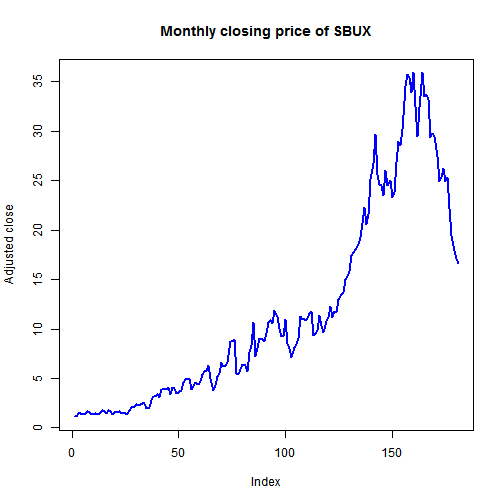
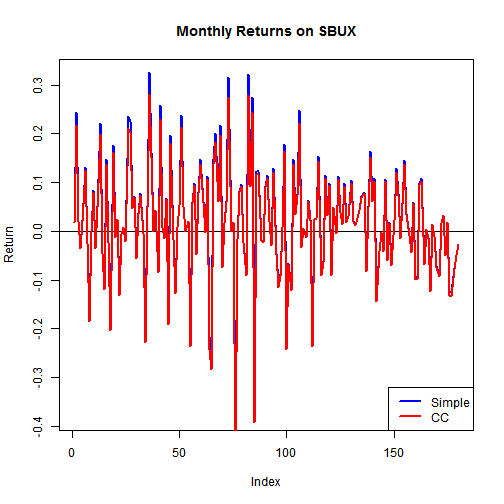

Lab 1 for Intorduction to computational finance
========================================================
# task1
+ Create a new variable data_url that contains the URL to the CSV file.
+ Create a new variable sbux_df that contains the data frame with the 
+ Starbucks data. sbux_df should be a data frame object. Data frames 

```r
# Assign the URL to the CSV file
data_url <- 'http://assets.datacamp.com/course/compfin/sbuxPrices.csv'
# Load the data frame using read.csv
sbux_df <- read.csv(data_url, header = T, stringsAsFactors = FALSE)
```

# task2
+ Have a look at the structure of the sbux_df data.
+ Have a look at the first and the last part of the Starbucks prices.
+ What is the class of the Date column of the sbux_df data frame?

```r
# Check the structure of 'sbux_df'
str(sbux_df)
```

```
## 'data.frame':	181 obs. of  2 variables:
##  $ Date     : chr  "3/31/1993" "4/1/1993" "5/3/1993" "6/1/1993" ...
##  $ Adj.Close: num  1.13 1.15 1.43 1.46 1.41 1.44 1.63 1.59 1.32 1.32 ...
```

```r
# Check the first and last part of 'sbux_df'
head(sbux_df)
```

```
##        Date Adj.Close
## 1 3/31/1993      1.13
## 2  4/1/1993      1.15
## 3  5/3/1993      1.43
## 4  6/1/1993      1.46
## 5  7/1/1993      1.41
## 6  8/2/1993      1.44
```

```r
tail(sbux_df)
```

```
##          Date Adj.Close
## 176 10/1/2007     25.37
## 177 11/1/2007     22.24
## 178 12/3/2007     19.46
## 179  1/2/2008     17.98
## 180  2/1/2008     17.10
## 181  3/3/2008     16.64
```

```r
# Get the class of the Date column of 'sbux_df'
class(sbux_df$Date)
```

```
## [1] "character"
```

# task3 
+ Assign to the variable closing_prices all the adjusted closing prices while preserving the dimension information.

```r
closing_prices <- sbux_df[,"Adj.Close", drop = F]
```

# task4
+ Assign to index_1 the row number of the row that contains the price on 3/1/1994.
+ Assign to index_2 the row number of the row that contains the price on 3/1/1995.
+ Assign to some_prices the SBUX closing prices between 3/1/1994 and 3/1/1995.

```r
# Find indices associated with the dates 3/1/1994 and 3/1/1995
index_1 <- which(sbux_df$Date == "3/1/1994")
index_2 <- which(sbux_df$Date == "3/1/1995")
# Extract prices between 3/1/1994 and 3/1/1995
some_prices <- sbux_df$Adj.Close[index_1:index_2]
```

# task 5
+ Assign to price_1 the Starbucks stock price on 3/1/1994.
+ Assign to price_2 the Starbucks stock price on 3/1/1995.

```r
# Create a new data frame that contains the price data with the dates as the row names
sbux_prices_df <- sbux_df[, "Adj.Close", drop=FALSE]
rownames(sbux_prices_df) <- sbux_df$Date
head(sbux_prices_df)
```

```
##           Adj.Close
## 3/31/1993      1.13
## 4/1/1993       1.15
## 5/3/1993       1.43
## 6/1/1993       1.46
## 7/1/1993       1.41
## 8/2/1993       1.44
```

```r
# With Dates as rownames, you can subset directly on the dates.
# Find indices associated with the dates 3/1/1994 and 3/1/1995.
price_1 <- sbux_prices_df["3/1/1994",1]
price_2 <- sbux_prices_df["3/1/1995",1]
```

# task 6
+ Let us make a better plot by adding the following arguments to the plot function: type="l" specifies a line plot, col="blue" indicates that the line should be blue, lwd=2 doubles the line thickness, ylab="Adjusted close" adds a y-axis label and main="Monthly closing price of SBUX" adds a title.
+ Now add all relevant arguments to the plot function below to get a nicer plot

```r
plot(sbux_df$Adj.Close, type = "l", col="blue", lwd=2, ylab = "Adjusted close", main="Monthly closing price of SBUX")
```

 

# task7
+ Assign to sbux_ret the simple returns for the Starbucks stock.

```r
sbux_prices_df <- sbux_df[, "Adj.Close", drop=FALSE]
# Denote n the number of time periods
n <- nrow(sbux_prices_df)
sbux_ret <- (sbux_prices_df[2:n,1] - sbux_prices_df[1:(n-1),1])/sbux_prices_df[1:(n-1),1]
# Notice that sbux_ret is not a data frame object
class(sbux_ret)
```

```
## [1] "numeric"
```

# task 8
+ Assign the correct dates as names to all elements of the return vector sbux_ret.
+ Use the head() function to display the first elements of sbux_ret.

```r
# Now add dates as names to the vector and print the first elements of sbux_ret to the console to check
names(sbux_ret) <- sbux_df$Date[2:n]
head(sbux_ret)
```

```
##    4/1/1993    5/3/1993    6/1/1993    7/1/1993    8/2/1993    9/1/1993 
##  0.01769912  0.24347826  0.02097902 -0.03424658  0.02127660  0.13194444
```

# task 9
+ Compute the continuously compounded returns and assign to sbux_ccret.
+ Set the names of the sbux_ccret to the correct dates, as you did in the previous exercise.
+ Use the head() function to display the first elements of sbux_ccret.

```r
# Compute continuously compounded 1-month returns
sbux_ccret <- log(sbux_prices_df[2:n, 1]) - log(sbux_prices_df[1:(n-1), 1])
# Assign names to the continuously compounded 1-month returns
names(sbux_ccret) <- sbux_df$Date[2:n]
# Show sbux_ccret
head(sbux_ccret)
```

```
##    4/1/1993    5/3/1993    6/1/1993    7/1/1993    8/2/1993    9/1/1993 
##  0.01754431  0.21791250  0.02076199 -0.03484673  0.02105341  0.12393690
```

# task 10
+ Use the cbind() and head() functions to display the simple and continuously compounded returns next to each other for the first time periods. What do you notice?

```r
head(cbind(sbux_ret,sbux_ccret))
```

```
##             sbux_ret  sbux_ccret
## 4/1/1993  0.01769912  0.01754431
## 5/3/1993  0.24347826  0.21791250
## 6/1/1993  0.02097902  0.02076199
## 7/1/1993 -0.03424658 -0.03484673
## 8/2/1993  0.02127660  0.02105341
## 9/1/1993  0.13194444  0.12393690
```

# task 11
+ Your task is to add the continuously compounded returns to the plot. This can be done with the lines() function, having sbux_ccret as a first argument. Furthermore, the line should be red and its thickness should be set to 2. You can do that by setting the col and lwd arguments.

```r
# Plot the returns on the same graph
plot(sbux_ret, type="l", col="blue", lwd=2, ylab="Return",
               main="Monthly Returns on SBUX")
# Add horizontal line at zero
abline(h=0)
# Add a legend
legend(x="bottomright", legend=c("Simple", "CC"), 
       lty=1, lwd=2, col=c("blue","red"))
# Add the continuously compounded returns
lines(sbux_ccret, type = "l", col = "red", lwd = 2)
```

 

# task 12
+ Assign to the variable sbux_gret the gross returns (which is the simple return + 1).
+ Assign to sbux_fv a vector that contains the future values of the $1 invested in SBUX for every time period.
+ Have a look at the plot. Would it have been a good idea to invest in SBUX?

```r
# Compute gross returns
sbux_gret <- sbux_ret+1
# Compute future values
sbux_fv <- cumprod(sbux_gret)
# Plot the evolution of the $1 invested in SBUX as a function of time
plot(sbux_fv, type="l", col="blue", lwd=2, ylab="Dollars", 
     main="FV of $1 invested in SBUX")
```

 

# task 13
+ Your workspace contains the vector sbux with the adjusted closing price data for Starbucks stock over the period December 2004 through December 2005. Type sbux in the console to have a look at the data.

```r
index1 <- which(sbux_df$Date == "12/1/2004")
index2 <- which(sbux_df$Date == "12/1/2005")
sbux <- sbux_df$Adj.Close[index1:index2]
names(sbux) <- sbux_df[index1:index2,"Date"]
```
+ Use the data in sbux. What is the simple monthly return between the end of December 2004 and the end of January 2005?

```r
(sbux[2]-sbux[1])/sbux[1]
```

```
##   1/3/2005 
## -0.1342327
```

# task 14
+ What is the continuously compounded monthly return between December 2004 and January 2005?

```r
log(sbux[2])-log(sbux[1])
```

```
##   1/3/2005 
## -0.1441391
```

# task 15
+ Assume that all twelve months have the same return as the simple monthly return between the end of December 2004 and the end of January 2005. What would be the annual return with monthly compounding in that case?

```r
r <- (sbux[2]-sbux[1])/sbux[1]
(1+r)^12-1
```

```
##  1/3/2005 
## -0.822657
```

# task 16
+ Use the data in sbux and compute the actual simple annual return between December 2004 and December 2005.

```r
rets <- (sbux[2:length(sbux)] - sbux[1:(length(sbux)-1)])/sbux[1:(length(sbux)-1)]
gross_rets <- 1+rets
cumprod(gross_rets)-1
```

```
##    1/3/2005    2/1/2005    3/1/2005    4/1/2005    5/2/2005    6/1/2005 
## -0.13423272 -0.16930860 -0.17166948 -0.20607083 -0.12141653 -0.17166948 
##    7/1/2005    8/1/2005    9/1/2005   10/3/2005   11/1/2005   12/1/2005 
## -0.15750422 -0.21382799 -0.19662732 -0.09308600 -0.02360877 -0.03743676
```

# task 17
+ Use the data sbux and compute the actual annual continuously compounded return between December 2004 and December 2005.

```r
log(sbux[length(sbux)])-log(sbux[1])
```

```
##   12/1/2005 
## -0.03815551
```


