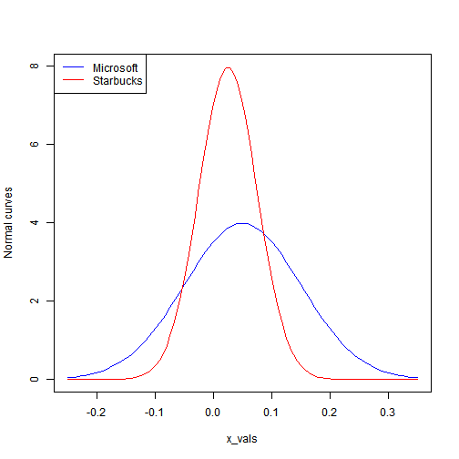

Lab 1 for Intorduction to computational finance
========================================================
# task 1 Compute probabilities
+ Assign to mu_x the mean of X.
+ Assign to sigma_x the standard deviation of X.
+ Compute the following probabilities and print the result to the console:
  - Pr(X > 0.10)
  - Pr(X < -0.10)
  - Pr(-0.05 < X < 0.15)

```r
# X ~ N(0.05, (0.10)^2)
mu_x = 0.05
sigma_x = 0.1
# Pr(X > 0.10)
1-pnorm(0.1,mu_x,sigma_x)
```

```
## [1] 0.3085375
```

```r
# Pr(X < -0.10)
pnorm(-0.1,mu_x,sigma_x)
```

```
## [1] 0.0668072
```

```r
# Pr(-0.05 < X < 0.15)
pnorm(0.15,mu_x,sigma_x)-pnorm(-0.05,mu_x,sigma_x)
```

```
## [1] 0.6826895
```

# task 2 Compute quantiles
+ Compute the 1%, 5%, 95% and 99% quantile with a single command. Do not assign it to a variable, just print it to the console.

```r
# The mean (mu_x) and the standard deviation (sigma_x) are still in your workspace
# 1%, 5%, 95% and 99% quantile
qnorm(c(0.01,0.05,0.95,0.99),mu_x,sigma_x)
```

```
## [1] -0.1826348 -0.1144854  0.2144854  0.2826348
```

# task 3 Compute densities
+ For the grid of values in x_vals, compute the values of the assumed normal density for the return on Microsoft stock and assign it to MSFT.
+ For the grid of values in x_vals, compute the values of the assumed normal density for the return on Starbucks stock and assign it to SBUX.

```r
# Normally distributed monthly returns
x_vals <- seq(-0.25, 0.35, length.out = 100)
MSFT <- dnorm(x_vals,0.05,0.1)
SBUX <- dnorm(x_vals,0.025,0.05)
```

# task 4 Plot normal curve
+ Plot a line for the values of the assumed normal density for the return on Microsoft stock (MSFT) against x_vals.
+ Customize the plot in the following way: use a blue line, set the y-axis label to "Normal curves", and set the y-axis to be in the interval [0,8].

```r
# MSFT and x_vals are still in your workspace

# Normal curve for MSFT
plot(x_vals,MSFT,type="l",col='blue',ylab="Normal curves",ylim=c(0,8))
```

 

# task 5 Add second normal curve
+ Add a red line for the values of the assumed normal density for the return on Starbucks stock (SBUX) against x_vals.

```r
# Normal curve for MSFT
plot(x_vals, MSFT, type = "l", col = "blue", ylab = "Normal curves", ylim = c(0, 8))
# Add a normal curve for SBUX
lines(x_vals, SBUX, col = "red")
# Add a plot legend
legend("topleft", legend = c("Microsoft", "Starbucks"), col = c("blue", "red"), lty = 1)
```

 

# task 6 Determine the value-at-risk of simple monthly returns
+ Assign to mu_R the mean of R.
+ Assign to sigma_R the standard deviation of R.
+ Assign to W0 the initial wealth.
+ Compute the 1% value-at-risk and print the result to the console.
+ Compute the 5% value-at-risk and print the result to the console.

```r
# R ~ N(0.04, (0.09)^2) 
mu_R <- 0.04
sigma_R <- 0.09
# Initial wealth W0 equals $100,000
W0 <- 100000
# The 1% value-at-risk
W0*qnorm(0.01,mu_R,sigma_R)
```

```
## [1] -16937.13
```

```r
# The 5% value-at-risk
W0*qnorm(0.05,mu_R,sigma_R)
```

```
## [1] -10803.68
```

# task 7 Determine the value-at-risk of continuously compounded monthly returns
+ Assign to mu_r the mean of r.
+ Assign to sigma_r the standard deviation of r.
+ Assign to W0 the initial wealth.
+ Compute the 1% value-at-risk and print the result to the console.
+ Compute the 5% value-at-risk and print the result to the console.

```r
# r ~ N(0.04, (0.09)^2) 
mu_r <- 0.04
sigma_r <- 0.09
# Initial wealth W0 equals $100,000
W0 <- 100000
# The 1% value-at-risk
W0*(exp(qnorm(0.01,0.04,0.09))-1)
```

```
## [1] -15580.46
```

```r
# The 5% value-at-risk
W0*(exp(qnorm(0.05,0.04,0.09))-1)
```

```
## [1] -10240.55
```

# task 8 Compute simple monthly returns
+ Assign to PA a vector that contains the prices of the Amazon stock.
+ Assign to PC a vector that contains the prices of the Costco stock.
+ Compute the simple monthly return on the Amazon stock and assign it to RA.
+ Compute the simple monthly return on the Costco stock and assign it to RC.

```r
# Vectors of prices
PA <- c(38.23,41.29)
PC <- c(41.11,41.74)
# Simple monthly returns
RA <- PA[2]/PA[1]-1
RC <- PC[2]/PC[1]-1
```

# task 9 Compute continuously compounded monthly returns
+ Compute the continuously compounded monthly return for Amazon and assign it to rA.
+ Compute the continuously compounded monthly return for Costco and assign it to rC.

```r
# Continuously compounded returns
rA <- log(1+RA)
rC <- log(1+RC)
```

# task 10 Compute simple total returns and dividend yields
+ Assign to DA the cash dividend per share.
+ Compute the monthly simple total return and assign it to RA_total.
+ Compute the monthly dividend yield and assign it to DY.

```r
# Cash dividend per share
DA <- 0.1
# Simple total return
RA_total <- (PA[2]+DA-PA[1])/PA[1]
# Dividend yield
DY <- DA/PA[1]
```

# task 11 Compute annual returns
+ Compute the simple annual return and assign it to RA_annual.
+ Compute the continuously compounded annual return and assign it to rA_annual.

```r
# Simple annual return
RA_annual <- (1+RA)^12 - 1
# Continuously compounded annual return
rA_annual <- log(1+RA_annual)
```

# task 12 Compute portfolio shares and portfolio returns
+ Compute the portfolio share of your Amazon stocks and assign it to xA.
+ Compute the portfolio share of your Costco stocks and assign it to xC.
+ Compute the simple monthly return on the portfolio and print the result to the console.

```r
# Portfolio shares
xA <- 8000/10000
xC <- 2000/10000
# Simple monthly return
xA*RA+xC*RC
```

```
## [1] 0.06709843
```

