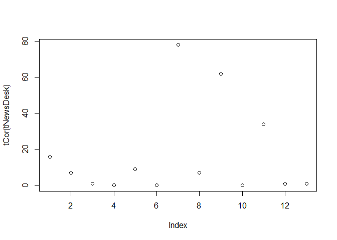
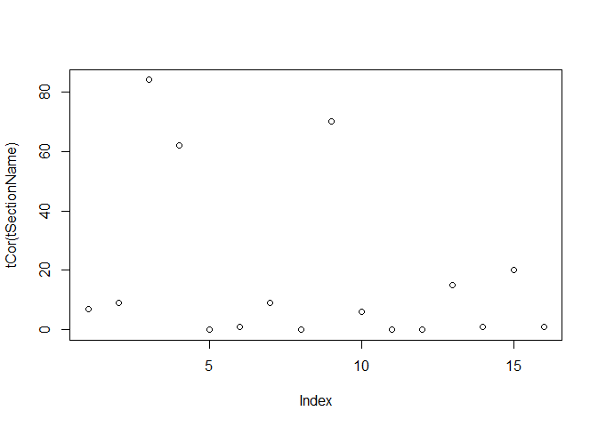
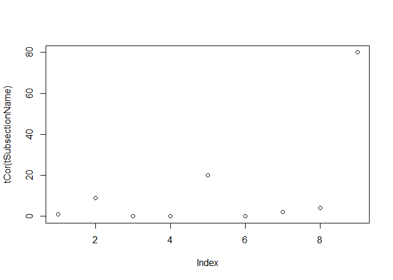
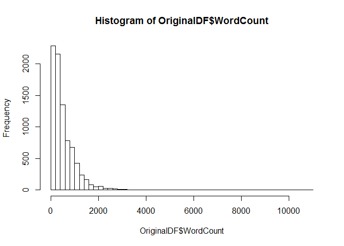
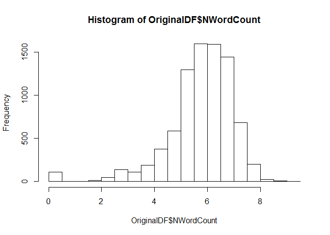
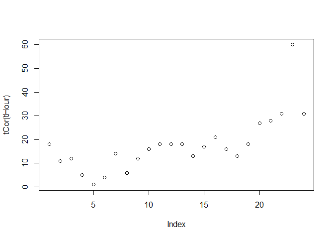
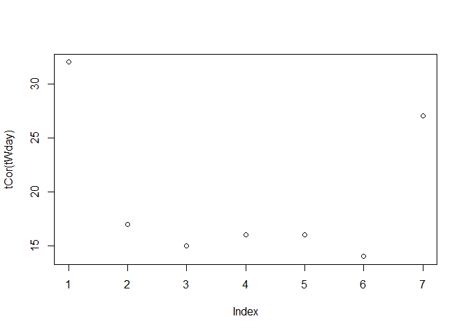
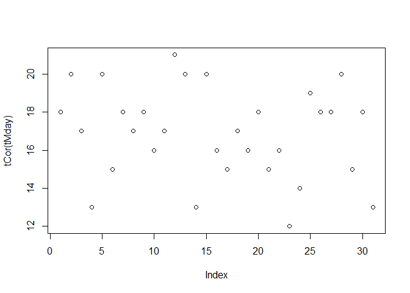
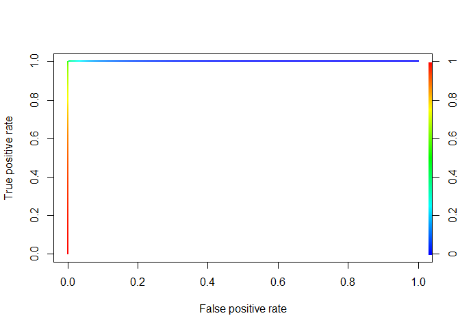
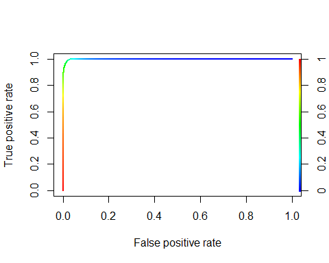

# Analytic Edge Kaggle NYT classifiction
Ryan Zhang  
Thursday, April 16, 2015  

# 0 Environment  
# 环境设定  
## Set working directory   
## 设定工作环境  

```r
setwd("~/GitHub/edX/The Analytic Edge/Kaggle")
```

## Load Libraries  
## 函数包  

```r
library(tm)
```

```
## Loading required package: NLP
```

```r
library(e1071)
library(randomForest)
```

```
## randomForest 4.6-10
## Type rfNews() to see new features/changes/bug fixes.
```

```r
library(ROCR)
```

```
## Loading required package: gplots
## 
## Attaching package: 'gplots'
## 
## The following object is masked from 'package:stats':
## 
##     lowess
```

```r
library(party)
```

```
## Loading required package: grid
## Loading required package: mvtnorm
## Loading required package: modeltools
## Loading required package: stats4
## Loading required package: strucchange
## Loading required package: zoo
## 
## Attaching package: 'zoo'
## 
## The following objects are masked from 'package:base':
## 
##     as.Date, as.Date.numeric
## 
## Loading required package: sandwich
```

## Function Definition  
## 自定义函数  
用于帮助求table后正类百分比的小函数    

```r
tCor <- function(t)round(t[,2]/rowSums(t),2)*100 
```

# 1 Data Preparing
# 1 数据准备工作
## 1.1 Data Loading
## 1.1 装载数据

```r
NewsTrain <- read.csv("NYTimesBlogTrain.csv", stringsAsFactors = F)
NewsTest <- read.csv("NYTimesBlogTest.csv", stringsAsFactors = F)
```

## 1.2 First Iteration in processing    
## 1.2 第一轮数据处理   
"Popular"" is the dependant variable, store it in a separate vector "Y", and delete the colomn from the 
dataframe "NewsTrain".      
要预测的因变量是“Popular”，将其存在一个单独的"Y"向量中,并从训练数据框中删除该列。

```r
Y <- as.factor(NewsTrain$Popular)
NewsTrain$Popular <- NULL
```

Store the number of training data points and the number of testing data points.        
记录一下训练数据和测试数据的数量。

```r
ntrain <- nrow(NewsTrain)
ntest <- nrow(NewsTest)
ntrain
```

```
## [1] 6532
```

```r
ntest
```

```
## [1] 1870
```

Combine "NewsTrain" and "NewsTest" into a single dataframe for the purpose of data preparing      
将训练数据和测试数据合并为一个单一的数据框，以便集中处理（这是否有问题？）    
**只要是非监督的变换应该都不算作弊**

```r
OriginalDF <- rbind(NewsTrain, NewsTest)
```

Filling empty entries for the first three columns with name "Other"      
将前三列里面的“”用“Other”替代

```r
for (i in 1:nrow(OriginalDF)){
  for (j in 1:3){
    if (OriginalDF[i,j] == ""){
      OriginalDF[i,j] <- "Other"}}}
```

Change the first three columns to be factors     
将前三个变量改成factor类型

```r
OriginalDF$NewsDesk <- as.factor(OriginalDF$NewsDesk)
OriginalDF$SectionName <- as.factor(OriginalDF$SectionName)
OriginalDF$SubsectionName <- as.factor(OriginalDF$SubsectionName)
```

Log Transform "WordCount"      
将WordCount做对数转换，（转换后变为正态分布）  

```r
# OriginalDF$ZWordCount <- with(OriginalDF, (WordCount - mean(WordCount))/sd(WordCount))
OriginalDF$NWordCount <- log(OriginalDF$WordCount + 1)
```

Conver the PubDate and time variable to be more R friendly and extract the hour of day, the day on month and the day of week to be seperate variables. Finally delete the PubDate column.       
将PubDate改成R的日期-时间格式，并将周几、每月几号以及每天几点这些信息单独抽取出来，删除原本的PubDate

```r
OriginalDF$PubDate <- strptime(OriginalDF$PubDate, "%Y-%m-%d %H:%M:%S")
OriginalDF$Hour <- as.factor(OriginalDF$PubDate$h)
OriginalDF$Wday <- as.factor(OriginalDF$PubDate$wday)
OriginalDF$Mday <- as.factor(OriginalDF$PubDate$mday)
# OriginalDF$isWeekend <- as.numeric(OriginalDF$Wday %in% c(0,6))
OriginalDF$PubDate <- NULL
```

Generate training and testing set    
生成训练和测试数据    

```r
train <- OriginalDF[1:ntrain, c(1:3,9:12)]
test <- OriginalDF[(ntrain+1):nrow(OriginalDF),c(1:3,9:12)]
```

## 1.3 Exploratory Data Analysis    
## 1.3 探索式数据分析    
First Explore the few factor variable and their relationship to the depandent variable.    
先看看前三个factor型数据与要预测的Popular之间的关系。    

```r
tNewsDesk <- table(OriginalDF$NewsDesk[1:ntrain], Y)
tNewsDesk
```

```
##           Y
##               0    1
##   Business 1301  247
##   Culture   626   50
##   Foreign   372    3
##   Magazine   31    0
##   Metro     181   17
##   National    4    0
##   OpEd      113  408
##   Other    1710  136
##   Science    73  121
##   Sports      2    0
##   Styles    196  101
##   Travel    115    1
##   TStyle    715    9
```

```r
tCor(tNewsDesk)
```

```
## Business  Culture  Foreign Magazine    Metro National     OpEd    Other 
##       16        7        1        0        9        0       78        7 
##  Science   Sports   Styles   Travel   TStyle 
##       62        0       34        1        1
```

```r
plot(tCor(tNewsDesk))
```

 

```r
tSectionName <- table(OriginalDF$SectionName[1:ntrain], Y)
tSectionName
```

```
##                   Y
##                       0    1
##   Arts              625   50
##   Business Day      999   93
##   Crosswords/Games   20  103
##   Health             74  120
##   Magazine           31    0
##   Multimedia        139    2
##   N.Y. / Region     181   17
##   Open                4    0
##   Opinion           182  425
##   Other            2171  129
##   Sports              1    0
##   Style               2    0
##   Technology        280   50
##   Travel            116    1
##   U.S.              405  100
##   World             209    3
```

```r
tCor(tSectionName)
```

```
##             Arts     Business Day Crosswords/Games           Health 
##                7                9               84               62 
##         Magazine       Multimedia    N.Y. / Region             Open 
##                0                1                9                0 
##          Opinion            Other           Sports            Style 
##               70                6                0                0 
##       Technology           Travel             U.S.            World 
##               15                1               20                1
```

```r
plot(tCor(tSectionName))
```

 

```r
tSubsectionName <- table(OriginalDF$SubsectionName[1:ntrain], Y)
tSubsectionName
```

```
##                    Y
##                        0    1
##   Asia Pacific       200    3
##   Dealbook           864   88
##   Education          325    0
##   Fashion & Style      2    0
##   Other             3846  980
##   Politics             2    0
##   Room For Debate     61    1
##   Small Business     135    5
##   The Public Editor    4   16
```

```r
tCor(tSubsectionName)
```

```
##      Asia Pacific          Dealbook         Education   Fashion & Style 
##                 1                 9                 0                 0 
##             Other          Politics   Room For Debate    Small Business 
##                20                 0                 2                 4 
## The Public Editor 
##                80
```

```r
plot(tCor(tSubsectionName))
```

 
SectionName, SubsectionName,NewsDesk应该都是有预测能力的变量，应该保留   

Looking at the text contents    
看看文本信息   
It seems that the "Snippet" is almost redudent with "Abstract", in since 98% cases they are the same. And "Abstract" contains a little bit more infomation than "Snippet"      
Snippet应该和Abstract的重合内容非常多，前者貌T似都属于后者，因而估计只用后者就好了。    

```r
sum(OriginalDF$Snippet == OriginalDF$Abstract)/nrow(OriginalDF)
```

```
## [1] 0.9846465
```

```r
which(OriginalDF$Snippet != OriginalDF$Abstract)[1]
```

```
## [1] 22
```

```r
OriginalDF[22,5]
```

```
## [1] "In an open letter, Su Yutong, a Chinese journalist who was fired from a German public broadcaster last month after a debate over the Tiananmen Square massacre, called on the broadcasters director general to speak out for press freedom while in..."
```

```r
OriginalDF[22,6]
```

```
## [1] "In an open letter, Su Yutong, a Chinese journalist who was fired from a German public broadcaster last month after a debate over the Tiananmen Square massacre, called on the broadcasters director general to speak out for press freedom while in China."
```

Looking at WordCount    
看看字数    
The distribution of WordCount seems to be a longtail / power-law distribution.    
字数的分布似乎是幂律分布的    

```r
summary(OriginalDF$WordCount)
```

```
##    Min. 1st Qu.  Median    Mean 3rd Qu.    Max. 
##     0.0   188.0   377.0   528.8   735.0 10910.0
```

```r
hist(OriginalDF$WordCount, breaks = 70)
```

 

```r
hist(OriginalDF$NWordCount)
```

 

Looking at publication day/weekday/hour related to Popular   
看看小时、周几、每月几号，这些有没有用   

```r
tHour <- table(OriginalDF$Hour[1:ntrain] , Y)
tCor(tHour)
```

```
##  0  1  2  3  4  5  6  7  8  9 10 11 12 13 14 15 16 17 18 19 20 21 22 23 
## 18 11 12  5  1  4 14  6 12 16 18 18 18 13 17 21 16 13 18 27 28 31 60 31
```

```r
plot(tCor(tHour))
```

 

```r
tWday <- table(OriginalDF$Wday[1:ntrain], Y)
tCor(tWday)
```

```
##  0  1  2  3  4  5  6 
## 32 17 15 16 16 14 27
```

```r
plot(tCor(tWday))
```

 

```r
tMday <- table(OriginalDF$Mday[1:ntrain], Y)
tCor(tMday)
```

```
##  1  2  3  4  5  6  7  8  9 10 11 12 13 14 15 16 17 18 19 20 21 22 23 24 25 
## 18 20 17 13 20 15 18 17 18 16 17 21 20 13 20 16 15 17 16 18 15 16 12 14 19 
## 26 27 28 29 30 31 
## 18 18 20 15 18 13
```

```r
plot(tCor(tMday))
```

 

```r
#tWeekend <- table(OriginalDF$isWeekend[1:ntrain], Y)
#tCor(tWeekend)
#plot(tCor(tWeekend))
```
每月几号看上去没啥用   

#2 Model fitting    
#2 模型拟合    
randomForest model    
随机森林模型    

```r
set.seed(880306)
rfModel <- randomForest(x = train,
                        y = Y,
                        ntree = 1000,
                        mtry = 2,
                        nodesize = 4,
                        importance = F,
                        proximity = F)
```

Make prediction on the training set
用模型对训练数据进行预测

```r
rfPred <- predict(rfModel, train, type = "prob")
table(rfPred[,2] > 0.5,Y)
```

```
##        Y
##            0    1
##   FALSE 5358  102
##   TRUE    81  991
```

```r
prediction <- ROCR::prediction(rfPred[,2], Y)
perf <- performance(prediction, "tpr", "fpr")
plot(perf, colorize = T, lwd = 2)
```

 

```r
auc <- performance(prediction, "auc")
auc@y.values
```

```
## [[1]]
## [1] 0.9967468
```

Make prediction with randomForest model
用随机森林模型做预测

```r
tpred <- predict(rfModel, test, type = "prob")
MySubmission = data.frame(UniqueID = NewsTest$UniqueID, Probability1 = tpred[,1])
write.csv(MySubmission, "rfRegularFeatures.csv", row.names = F)
```

cforest

```r
ctrain <- cbind(train,Y)
set.seed(12345)
crfModel <- cforest(Y~., data = ctrain)
crfPred <- predict(crfModel, newdata = ctrain, type = "prob")
crftpred <- vector()
for (i in 1:ntrain){
  crftpred <- c(crftpred, crfPred[[i]][2])
  
}
table(crftpred > 0.5,Y)
```

```
##        Y
##            0    1
##   FALSE 5307  280
##   TRUE   132  813
```

```r
crfPred <- predict(crfModel, newdata =test, type = "prob")
crftpred <- vector()
for (i in 1:ntest){
  crftpred <- c(crftpred, crfPred[[i]][2])
  
}

MySubmission = data.frame(UniqueID = NewsTest$UniqueID, Probability1 = crftpred)
write.csv(MySubmission, "crfRegularFeatures.csv", row.names = F)
```

#3 Try feature engineering with text content    
#3 尝试通过文本数据做特征工程     

## TFIDF   
## 术语频次·逆文档频次  
Extract all headline and abstract to form a corpus    
抽取题名和摘要文本构建一个语料库    

```r
text <- vector()
for (i in 1:nrow(OriginalDF)) {
  text <- rbind(text, paste(OriginalDF$Headline[i], " ", OriginalDF$Abstract[i]))
}

Corpus <- Corpus(VectorSource(text))
```

Standard Corpus processing     
标准化的语料库处理     

```r
Corpus <- tm_map(Corpus, tolower)     
Corpus <- tm_map(Corpus, PlainTextDocument)    
Corpus <- tm_map(Corpus, removePunctuation)    
Corpus <- tm_map(Corpus, removeWords, stopwords("english"))     
Corpus <- tm_map(Corpus, stemDocument)    
```

Document ~ TF-IDF matrix    
构建文档~TFIDF矩阵     

```r
dtm <- DocumentTermMatrix(Corpus, control = list(weighting = weightTfIdf))    
```

Get the terms    
获取术语列表     

```r
terms <- dtm$dimnames$Terms    
terms[5101:5110]
```

```
##  [1] "envi"             "enviabl"          "environ"         
##  [4] "environment"      "environmentalist" "environmentmind" 
##  [7] "envoy"            "enzym"            "eon"             
## [10] "eotvo"
```

Get the matrix for training and testing set     
分别获得训练和测试数据的Document~TF-IDF矩阵     

```r
dtmTrain <- dtm[1:ntrain,]
dtmTest <- dtm[(1+ntrain):dtm$nrow,]
```

Get frequent terms matrix for testing set
获得测试集的频繁术语

```r
sparseTest <- removeSparseTerms(dtmTest, 0.96)
wordsTest <- as.data.frame(as.matrix(sparseTest))
termsTest <- names(wordsTest)
```

Filter the dtm based on frequent terms in testing set    
根据测试集的频繁术语，对原本的矩阵进行筛选     

```r
cols <- vector()
for (i in 1:length(termsTest)){
  cols = c(cols, which((terms == termsTest[i]) == T))
}
dtmFiltered <- dtm[,cols]
```

Text Feature    
文本特征      

```r
termFeatures <- as.data.frame(as.matrix(dtmFiltered))
row.names(termFeatures) <- c(1:nrow(OriginalDF))
```

Append text features to the dataframe    

```r
TextADDDF <- as.data.frame(termFeatures)
```


```r
tatrain <- cbind(train, TextADDDF[1:ntrain,])
tatest <- cbind(test, TextADDDF[(ntrain+1):nrow(TextADDDF),])
```

## randomForest model with text features added    
## 加了文本特征的随机森林模型    

```r
set.seed(880306)
tarfModel <- randomForest(x = tatrain,
                        y = Y,
                        ntree = 1000,
                        nodesize = 4,
                        importance = T,
                        proximity = F)
```

Look at the importance of features via training randomForest   
看看文本特征的重要性    

```r
tarfModel$importance
```

```
##                            0             1 MeanDecreaseAccuracy
## NewsDesk        6.741356e-02  1.092329e-01         7.438759e-02
## SectionName     9.389658e-02  1.261535e-01         9.928177e-02
## SubsectionName  4.074622e-02  2.942022e-02         3.885447e-02
## NWordCount      2.948279e-02  8.854739e-02         3.935081e-02
## Hour            1.345084e-02  2.809807e-02         1.590120e-02
## Wday            6.637948e-03  5.883856e-03         6.507296e-03
## Mday            3.721095e-03 -6.914420e-03         1.942193e-03
## busi            1.680327e-04  9.294941e-04         2.954295e-04
## can             1.020851e-03 -1.123474e-03         6.625746e-04
## compani         7.723760e-05  2.242224e-03         4.386851e-04
## day             6.986680e-04  1.994922e-03         9.148566e-04
## get             1.192409e-04 -1.145431e-04         8.038500e-05
## holiday         1.826994e-05  4.060872e-05         2.211479e-05
## new             1.753845e-03  3.851044e-03         2.105095e-03
## obama           1.318826e-04  8.952406e-05         1.246532e-04
## one             1.329320e-04 -2.444800e-04         7.034757e-05
## presid          2.055510e-04 -2.482352e-04         1.304924e-04
## report          1.148631e-03  1.139174e-03         1.147981e-03
## said            1.363014e-05  5.151324e-04         9.596379e-05
## say            -1.145332e-05 -4.104990e-06        -9.280974e-06
## state           2.067014e-04 -7.110133e-05         1.608185e-04
## time            6.530400e-04  9.742312e-04         7.065211e-04
## today           2.104928e-03  7.039273e-04         1.870567e-03
## will            4.387393e-04  1.230304e-03         5.707581e-04
## year            1.269276e-04  1.064227e-03         2.849845e-04
## york            2.045278e-03  7.493456e-04         1.828384e-03
##                MeanDecreaseGini
## NewsDesk             299.485265
## SectionName          407.426762
## SubsectionName        49.077368
## NWordCount           221.942783
## Hour                 188.681089
## Wday                  61.348279
## Mday                 192.468174
## busi                   4.862253
## can                   14.061753
## compani                9.666681
## day                    7.926857
## get                    8.634849
## holiday                1.928577
## new                   21.874343
## obama                  4.140176
## one                   14.222004
## presid                 6.456700
## report                 7.393292
## said                  10.749057
## say                   10.922739
## state                  7.056526
## time                  10.749815
## today                  6.192084
## will                  16.211561
## year                  10.714690
## york                   7.046009
```
貌似都挺低的。。。    

Make prediction on the training set
用加了文本特征的随机森林模型对训练数据进行预测

```r
tarfPred <- predict(tarfModel, tatrain, type = "prob")
table(tarfPred[,2] > 0.5,Y)
```

```
##        Y
##            0    1
##   FALSE 5400   63
##   TRUE    39 1030
```

```r
prediction <- ROCR::prediction(tarfPred[,2], Y)
perf <- performance(prediction, "tpr", "fpr")
plot(perf, colorize = T, lwd = 2)
```

 

```r
auc <- performance(prediction, "auc")
auc@y.values
```

```
## [[1]]
## [1] 0.9987317
```

Make prediction with randomForest model
加了文本特征的随机森林模型做预测

```r
tatpred <- predict(tarfModel, tatest, type = "prob")
MySubmission = data.frame(UniqueID = NewsTest$UniqueID, Probability1 = tpred[,1])
write.csv(MySubmission, "rfText.csv", row.names = F)
```

## Why not a neural net?      
## 试试神经网络      
Neural net based on numerical features.    
基于数值特征的神经网络（没有GPU 炒鸡慢）       

```r
library(neuralnet)
nntrain <- tatrain[,c(4,8:26)]
nntest <- tatest[,c(4,8:26)]
nntrain$Popular <- as.numeric(as.character(Y))
nameofvars <- names(nntrain)
nnformula <- as.formula(paste("Popular ~", 
                        paste(nameofvars[!nameofvars %in% "Popular"], collapse = " + ")))
ptm <- proc.time()
nn <- neuralnet(formula = nnformula,
                data = nntrain, 
                hidden = 2,
                threshold = 0.02,
                stepmax = 1e8,
                err.fct="ce",
                linear.output=FALSE)
plot(nn)
pnn <- compute(nn,nntrain[,1:20])
summary(pnn$net.result)
```

```
##        V1            
##  Min.   :0.02651424  
##  1st Qu.:0.04543004  
##  Median :0.09536798  
##  Mean   :0.16732731  
##  3rd Qu.:0.28392093  
##  Max.   :0.99988792
```

```r
nnpredict <- as.vector(pnn$net.result)
prediction <- ROCR::prediction(nnpredict, Y)
perf <- performance(prediction, "tpr", "fpr")
plot(perf, colorize = T, lwd = 2)
auc <- performance(prediction, "auc")
auc@y.values
```

```
## [[1]]
## [1] 0.7848970206
```

```r
proc.time() - ptm
```

```
##    user  system elapsed 
##  308.58    0.01  309.46
```

## 做个聚类看看
## Clustering on TFIDF matrix

```r
cTest <- removeSparseTerms(dtmTest, 0.98)
cWords <- as.data.frame(as.matrix(cTest))
cTerms <- names(cWords)

cols <- vector()
for (i in 1:length(cTerms)){
  cols = c(cols, which((terms == cTerms[i]) == T))
}
cdtm <- dtm[,cols]
cMatrix <- as.matrix(cdtm)
cDF <- as.data.frame(cMatrix)

kmclusters <- kmeans(cDF, 9, iter.max = 5000)

tactrain <- cbind(tatrain, kmclusters$cluster[1:ntrain])
names(tactrain) <- c(names(tactrain)[1:26],"cluster")
tactest <- cbind(tatest, kmclusters$cluster[(1+ntrain):nrow(OriginalDF)])
names(tactest) <- c(names(tactest)[1:26],"cluster")
```

Another randomForest with cluster labels    
加上聚类标签后再来一个随机森林    

```r
set.seed(1126)
tacrfModel <- randomForest(x = tactrain,
                        y = Y,
                        ntree = 1000,
                        nodesize = 4,
                        importance = T,
                        proximity = F)
tacrfModel$importance
```

```
##                                 0                  1 MeanDecreaseAccuracy
## NewsDesk        0.064440842052554  0.112557385041662    0.072478785890433
## SectionName     0.092266010479351  0.124741331561146    0.097688734720652
## SubsectionName  0.043727953324982  0.033032507064183    0.041934413509678
## NWordCount      0.029244304360978  0.088022131524731    0.039075112464806
## Hour            0.012761502225103  0.029004265821257    0.015472070024610
## Wday            0.006857137224175  0.007669153438586    0.006990799915467
## Mday            0.003189772878526 -0.008507347488640    0.001232016771412
## busi            0.000244940826857  0.001112555742747    0.000390179597804
## can             0.001261139124872 -0.001011922471392    0.000878090010187
## compani         0.000035852235649  0.002623652712256    0.000471105406584
## day             0.000833359847324  0.002748037905825    0.001154730684509
## get             0.000142896921861  0.000092549980857    0.000134135829552
## holiday         0.000028887029172 -0.000003013133774    0.000023624637511
## new             0.002026132632755  0.004193659644276    0.002387117549858
## obama           0.000209171082249  0.000085115794274    0.000189404575340
## one             0.000155194248768 -0.000133117013097    0.000106374737713
## presid          0.000213941952248 -0.000341242879833    0.000120948232777
## report          0.001266496601207  0.001192482567627    0.001253925448199
## said           -0.000006493612102  0.000478235792260    0.000073399240133
## say            -0.000013912145609  0.000095293020544    0.000005100706707
## state           0.000171967557417 -0.000145969275241    0.000118437792381
## time            0.000718678296095  0.001032203375862    0.000769567578423
## today           0.002137941318733  0.000547888359566    0.001872497319653
## will            0.000465365688903  0.001081672909667    0.000568250082291
## year            0.000110218949897  0.001408966248372    0.000327599948374
## york            0.002059300464941  0.000581817532856    0.001811723467328
## cluster         0.001460456407490  0.000856633648507    0.001360483314837
##                MeanDecreaseGini
## NewsDesk          303.972981740
## SectionName       399.218918891
## SubsectionName     49.245442095
## NWordCount        220.843727011
## Hour              186.202891050
## Wday               60.101284886
## Mday              188.743295341
## busi                4.859654238
## can                14.760669856
## compani             9.139214080
## day                 7.999595138
## get                 8.419714954
## holiday             2.015642040
## new                21.526058501
## obama               3.756493292
## one                13.707604428
## presid              6.116362993
## report              7.124132835
## said               10.627462805
## say                10.825350900
## state               6.927241480
## time               10.458574606
## today               6.027968421
## will               16.007573628
## year               10.463039944
## york                7.101026444
## cluster            19.063941729
```

```r
tacrfPred <- predict(tacrfModel, tactrain, type = "prob")
table(tacrfPred[,2] > 0.5,Y)
```

```
##        Y
##            0    1
##   FALSE 5404   58
##   TRUE    35 1035
```

```r
prediction <- ROCR::prediction(tacrfPred[,2], Y)
perf <- performance(prediction, "tpr", "fpr")
plot(perf, colorize = T, lwd = 2)
```

 

```r
auc <- performance(prediction, "auc")
auc@y.values
```

```
## [[1]]
## [1] 0.9988373085
```

```r
tacrfPred <- predict(tacrfModel, newdata = tactest, type = "prob")
MySubmission = data.frame(UniqueID = NewsTest$UniqueID, Probability1 = tacrfPred[,2])
write.csv(MySubmission, "rfTextCluster.csv", row.names = F)
```

## Matrix Factorization   
##矩阵分解  

```r
s <- svd(cMatrix)
Sig <- diag(s$d)
```

