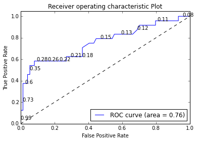

# Unit 3, Modeling the Expert
## Video 4
## Read in dataset

    import os
    os.chdir('C:\Users\Violetta_Chen\Downloads')
    import pandas as pd
    quality = pd.read_csv('quality.csv')

## Look at structure

    def dfStr(df):
        print "The dataframe contains {0} rows and {1} columns".format(df.shape[0], df.shape[1])
        print "The data types of columns are: \n"
        print quality.dtypes
    
    dfStr(quality)

    The dataframe contains 131 rows and 14 columns
    The data types of columns are: 
    
    MemberID                  int64
    InpatientDays             int64
    ERVisits                  int64
    OfficeVisits              int64
    Narcotics                 int64
    DaysSinceLastERVisit    float64
    Pain                      int64
    TotalVisits               int64
    ProviderCount             int64
    MedicalClaims             int64
    ClaimLines                int64
    StartedOnCombination       bool
    AcuteDrugGapSmall         int64
    PoorCare                  int64
    dtype: object
    

## Table outcome

    quality.groupby('PoorCare').size()

    PoorCare
    0           98
    1           33
    dtype: int64

## Baseline accuracy

    98.0/131

    0.7480916030534351

## Create training and testing sets
I will be using `train_test_split` from scikit-learn to split the dataset into
training and testing sets
The data types returned by `train_test_split` in default is `object`, thus you
need to convert them back when creating dataframes using `pandas`

    from sklearn.cross_validation import train_test_split
    train, test = train_test_split(quality, train_size=0.75, random_state=88)
    qualityTrain = pd.DataFrame(train, columns=quality.columns).convert_objects(convert_numeric=True)
    qualityTest = pd.DataFrame(test, columns=quality.columns).convert_objects(convert_numeric=True)

## Logistic Regression Model Using `statsmodels`
Need to create a dummy variable for intercept

    qualityTrain['Intercept'] = 1
    import statsmodels.api as sm
    QualityLog = sm.Logit(qualityTrain['PoorCare'], qualityTrain[['OfficeVisits','Narcotics','Intercept']]).fit()
    print QualityLog.summary()

    Optimization terminated successfully.
             Current function value: 0.444149
             Iterations 6
                               Logit Regression Results                           
    ==============================================================================
    Dep. Variable:               PoorCare   No. Observations:                   98
    Model:                          Logit   Df Residuals:                       95
    Method:                           MLE   Df Model:                            2
    Date:                Tue, 17 Mar 2015   Pseudo R-squ.:                  0.2021
    Time:                        20:20:54   Log-Likelihood:                -43.527
    converged:                       True   LL-Null:                       -54.553
                                            LLR p-value:                 1.627e-05
    ================================================================================
                       coef    std err          z      P>|z|      [95.0% Conf. Int.]
    --------------------------------------------------------------------------------
    OfficeVisits     0.0662      0.029      2.284      0.022         0.009     0.123
    Narcotics        0.0914      0.034      2.728      0.006         0.026     0.157
    Intercept       -2.5916      0.536     -4.831      0.000        -3.643    -1.540
    ================================================================================
    

## Make predictions on training set

    predictTrain =  QualityLog.predict()
    print predictTrain

    [ 0.44804085  0.21694573  0.29511069  0.10638046  0.12063874  0.17171362
      0.15044291  0.10638046  0.95186367  0.18749341  0.22398514  0.89762931
      0.10025035  0.1421777   0.08250811  0.96558687  0.15909948  0.35013628
      0.16815557  0.07876858  0.61136782  0.21963118  0.11283841  0.16815557
      0.59936938  0.12231827  0.17533109  0.1421777   0.51004889  0.22126155
      0.65030407  0.10025035  0.09883971  0.08061857  0.12678436  0.12783842
      0.28153139  0.10638046  0.11538835  0.73326513  0.16815557  0.10638046
      0.17670707  0.42244942  0.12960342  0.21269111  0.18133288  0.10025035
      0.1196359   0.26220461  0.15044291  0.82127603  0.1196359   0.32337278
      0.99057612  0.11798824  0.43400898  0.14026906  0.11127253  0.22181975
      0.25616129  0.11283841  0.2084977   0.12960342  0.14026906  0.29708806
      0.1196359   0.14646413  0.17171362  0.11283841  0.16815557  0.10880236
      0.11798824  0.10638046  0.27020582  0.34227949  0.14646413  0.2525626
      0.15909948  0.11283841  0.11283841  0.06968276  0.27084455  0.21269111
      0.2573541   0.13540162  0.12063874  0.65382403  0.07876858  0.11538835
      0.1421777   0.2345752   0.24315831  0.14528208  0.23569935  0.14528208
      0.7091744   0.10025035]
    

## Analyze predictions
I am taking advantage of the `describe()` and `groupby()` functions of
`DataFrame` objects to do the calculations.

    print pd.DataFrame(predictTrain).describe()

                   0
    count  98.000000
    mean    0.244898
    std     0.214547
    min     0.069683
    25%     0.117988
    50%     0.159099
    75%     0.257056
    max     0.990576
    

    df = pd.DataFrame({'predictTrain':predictTrain, 'PoorCare':qualityTrain['PoorCare']})
    df.groupby('PoorCare')['predictTrain'].mean()

    PoorCare
    0           0.183462
    1           0.434325
    Name: predictTrain, dtype: float64

# Video 5
## Confusion matrix for threshold of 0.5
A little bit trickier to do the table

    df['boolean'] = df['predictTrain'] >= 0.5
    print df.groupby(['PoorCare','boolean']).size()

    PoorCare  boolean
    0         False      71
              True        3
    1         False      15
              True        9
    dtype: int64
    

## Sensitivity and specificity

    9/24.0

    0.375

    71/74.0

    0.9594594594594594

## Confusion matrix for threshold of 0.7

    df['boolean'] = df['predictTrain'] >= 0.7
    print df.groupby(['PoorCare','boolean']).size()

    PoorCare  boolean
    0         False      73
              True        1
    1         False      18
              True        6
    dtype: int64
    

## Sensitivity and specificity

    6/24.0

    0.25

    73/74.0

    0.9864864864864865

## Confusion matrix for threshold of 0.2
This time using `confusion_matrix` from `scikit-learn`

    from sklearn.metrics import confusion_matrix
    df['boolean'] = df['predictTrain'] >= 0.2
    print confusion_matrix(df['PoorCare'] == 1, df['boolean'])

    [[51 23]
     [ 9 15]]
    

## Sensitivity and specificity

    15.0/24

    0.625

    51.0/74

    0.6891891891891891

# Video 6
## Performance function
Using `metrics` from `scikit-learn`

    from sklearn.metrics import roc_curve, auc
    fpr, tpr, thresholds = roc_curve(df['PoorCare'] == 1, df['predictTrain'])
    roc_auc = auc(fpr, tpr)

## Plot ROC curve
I have given up on coloring the line... and the thresholds are not as nice as
R's ROCR package.

    import matplotlib.pyplot as plt
    plt.figure()
    plt.plot(fpr, tpr, label='ROC curve (area = %0.2f)' % roc_auc)
    plt.plot([0, 1], [0, 1], 'k--')
    for i in range(len(fpr)):
        if i%5 == 0:
            plt.text(fpr[i],tpr[i],str(round(thresholds[i],2)))
    plt.xlim([0.0, 1.0])
    plt.ylim([0.0, 1.05])
    plt.xlabel('False Positive Rate')
    plt.ylabel('True Positive Rate')
    plt.title('Receiver operating characteristic Plot')
    plt.legend(loc="lower right")
    plt.show()

    
